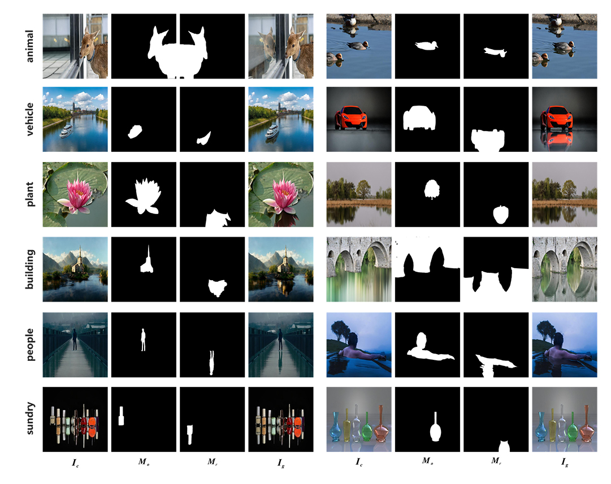

# Object-Reflection-Generation-Dataset-DEROBA

## Dataset Overview
**DEROBA** is a large-scale real-world dataset for reflection generation, containing carefully curated object-reflection pairs. This dataset is particularly valuable for tasks such as:
- Image composition
- Realistic object insertion
- Reflection generation

In the figure below, from left to right in each group, we show the composite image, the foreground mask, the reflection mask, and the ground-truth image.  

### Sample Structure:
1. **Composite image**  
2. **Foreground mask**  
3. **Reflection mask**  
4. **Ground-truth image**
5. **Original image**
6. **Inpainted image**

## Download
The full-resolution version is available on: [[Baidu_Cloud]](https://pan.baidu.com/s/1yM_Xza9luTQlyYdlCfhlZw?pwd=bcmi) (access code: bcmi).

The 512-resolution version is available on: [[Baidu_Cloud]](https://pan.baidu.com/s/13VxuVwQWFqoQa4vGLwjqmA?pwd=bcmi) (access code: bcmi).
