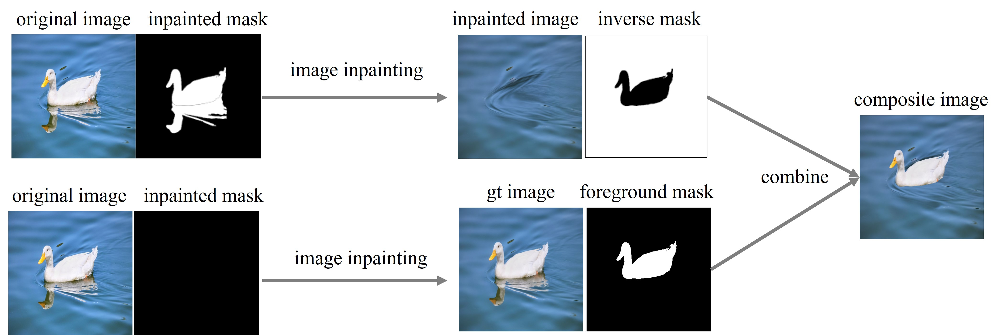

# Object-Reflection-Generation-Dataset-DEROBA

## Dataset Overview
**DEROBA** is a large-scale real-world dataset for reflection generation, i.e., generating plausible reflection for the inserted foreground object, which is particularly valuable for image composition (object insertion). DEROBA contains 16,791 different images and 21,016 object-reflection pairs. The figure below shows several examples. From left to right in each example, we show the composite image, the foreground mask, the reflection mask, and the ground-truth image.  


## Dataset Construction

We collect **original_image** with object reflections from [pixabay](https://pixabay.com/) and annotate the **foreground_mask**, **reflection_mask**. Then, for each object-reflection pair, we employ image inpainting model to erase the object and reflection, resulting in **inpainted_image**. Because inpainting causes color disturbation, we apply image inpainting model with empty mask to get the **ground-truth_image**. We crop the foreground from **ground-truth_image** and paste it on the **inpainted_image** to obtain **composite_image**. 



## Dataset Download

We provide two versions: the full-resolution version and the 512-resolution version. The full-resolution version is available on: [[Baidu_Cloud]](https://pan.baidu.com/s/1yM_Xza9luTQlyYdlCfhlZw?pwd=bcmi) (access code: bcmi) or [[Dropbox]](https://www.dropbox.com/scl/fi/31iiqkgdo2etuut91byt4/DEROBA.tar?rlkey=l4jmetz45enwpi72mnsbknz04&st=uaqunlyi&dl=0). The 512-resolution version is available on: [[Baidu_Cloud]](https://pan.baidu.com/s/13VxuVwQWFqoQa4vGLwjqmA?pwd=bcmi) (access code: bcmi). We also provide the training-test split. Each version has the following file structure:

```
  ├── composite_image:
       ├── alpacas-7604526_box0.png
       ├── alpacas-7604526_box1.png
       ├── ……
  ├── foreground_mask:
       ├── alpacas-7604526_box0.png
       ├── alpacas-7604526_box1.png
       ├── ……
  ├── reflection_mask:
       ├── alpacas-7604526_box0.png
       ├── alpacas-7604526_box1.png
       ├── ……
  ├── ground-truth_image:
       ├── alpacas-7604526_box0.png
       ├── alpacas-7604526_box1.png
       ├── ……
  ├── inpainted_image:
       ├── alpacas-7604526_box0.png
       ├── alpacas-7604526_box1.png
       ├── ……
  ├── original_image:
       ├── alpacas-7604526_box0.png
       ├── alpacas-7604526_box1.png
       ├── ……
  ├── train.txt
  └── test.txt
  ```

## Other Resources

+ [Awesome-Object-Shadow-Generation](https://github.com/bcmi/Awesome-Object-Shadow-Generation)
+ [Awesome-Image-Composition](https://github.com/bcmi/Awesome-Object-Insertion)
