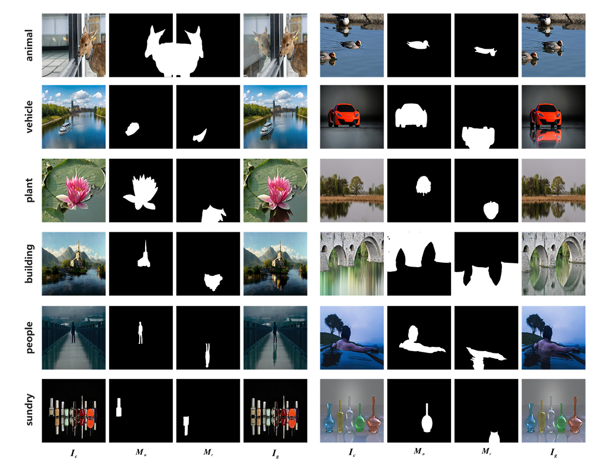
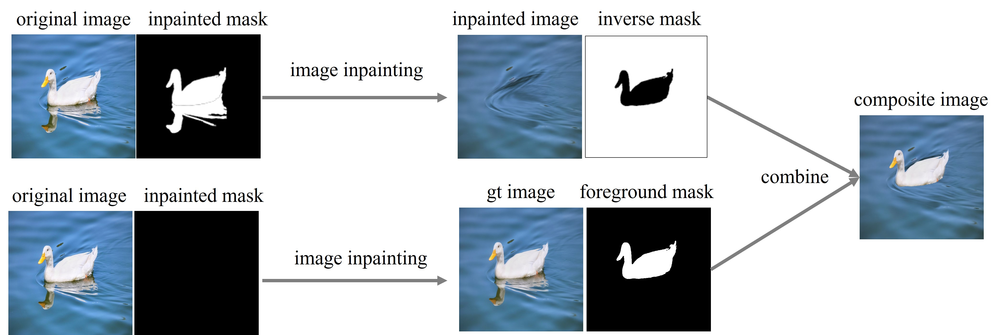

# Object-Reflection-Generation-Dataset-DEROBA


This is the official repository for the following paper:

> **Reflection Generation for Composite Image Using Diffusion Model**  [[arXiv]](https://arxiv.org/pdf/2604.02168)<br>
>
> Haonan Zhao, Qingyang Liu, Jiaxuan Chen, Li Niu<br>
> Accepted by **ICME 2026**.


## Dataset Overview
**DEROBA** is a large-scale real-world dataset for reflection generation, i.e., generating plausible reflection for the inserted foreground object, which is particularly valuable for image composition (object insertion). DEROBA contains 16,791 different images and 21,016 object-reflection pairs. The figure below shows several examples. From left to right in each example, we show the composite image, the foreground mask, the reflection mask, and the ground-truth image.  



## Online Demo

Try this [online demo](http://libcom.ustcnewly.com/) for image composition (object insertion) built upon [libcom](https://github.com/bcmi/libcom) toolbox and have fun!

[![]](https://github.com/user-attachments/assets/87416ec5-2461-42cb-9f2d-5030b1e1b5ec)

## Dataset Construction

We collect **original_image** with object reflections from [pixabay](https://pixabay.com/) and annotate the **foreground_mask**, **reflection_mask**. Then, for each object-reflection pair, we employ image inpainting model to erase the object and reflection, resulting in **inpainted_image**. Because inpainting causes color disturbation, we apply image inpainting model with empty mask to get the **ground-truth_image**. We crop the foreground from **ground-truth_image** and paste it on the **inpainted_image** to obtain **composite_image**. 



## Dataset Download

We provide two versions: the full-resolution version and the 512-resolution version. The full-resolution version is available on: [[Baidu_Cloud]](https://pan.baidu.com/s/1yM_Xza9luTQlyYdlCfhlZw?pwd=bcmi) (access code: bcmi) or [[Dropbox]](https://www.dropbox.com/scl/fi/31iiqkgdo2etuut91byt4/DEROBA.tar?rlkey=l4jmetz45enwpi72mnsbknz04&st=uaqunlyi&dl=0). The 512-resolution version is available on: [[Baidu_Cloud]](https://pan.baidu.com/s/13VxuVwQWFqoQa4vGLwjqmA?pwd=bcmi) (access code: bcmi) or [[Dropbox]](https://www.dropbox.com/scl/fi/9xxs865gahaloej0wev2y/DEROBA_512.tar?rlkey=7zua8nmjhekyooavatg7xc9ui&st=yvrqmf8c&dl=0). We also provide the training-test split. Each version has the following file structure:

```
  ├── composite_image:
       ├── alpacas-7604526_box0.png
       ├── alpacas-7604526_box1.png
       ├── ……
  ├── foreground_mask:
       ├── alpacas-7604526_box0.png
       ├── alpacas-7604526_box1.png
       ├── ……
  ├── reflection_mask:
       ├── alpacas-7604526_box0.png
       ├── alpacas-7604526_box1.png
       ├── ……
  ├── ground-truth_image:
       ├── alpacas-7604526_box0.png
       ├── alpacas-7604526_box1.png
       ├── ……
  ├── inpainted_image:
       ├── alpacas-7604526_box0.png
       ├── alpacas-7604526_box1.png
       ├── ……
  ├── original_image:
       ├── alpacas-7604526_box0.png
       ├── alpacas-7604526_box1.png
       ├── ……
  ├── train.txt
  └── test.txt
  ```

## Installation
- Clone this repo:
    git clone https://github.com/bcmi/Object-Reflection-Generation-Dataset-DEROBA.git
- Download the DEROBA dataset to `./data/`.
- Download the checkpoints from [[Hugging Face]](https://huggingface.co/2zz-n/RGDiffusion) to `./models/`.

## Environment
    conda create -n RGDiffusion python=3.8
    conda activate RGDiffusion
    pip install -r requirements.txt

## Training
    python train.py

## Inference
    python test.py

## Other Resources

+ [Awesome-Object-Reflection-Generation](https://github.com/bcmi/Awesome-Object-Reflection-Generation)
+ [Awesome-Image-Composition](https://github.com/bcmi/Awesome-Object-Insertion)

## Bibtex

If you use our DEROBA dataset, please cite the following BibTeX  [[arxiv](https://arxiv.org/pdf/2604.02168)]:

```
@article{deroba2026,
  title={Reflection Generation for Composite Image Using Diffusion Model},
  author={Zhao, Haonan and Liu, Qingyang and Chen, Jiaxuan and Niu, Li },
  journal={arXiv preprint arXiv:2604.02168},
  year={2026}
}
```
